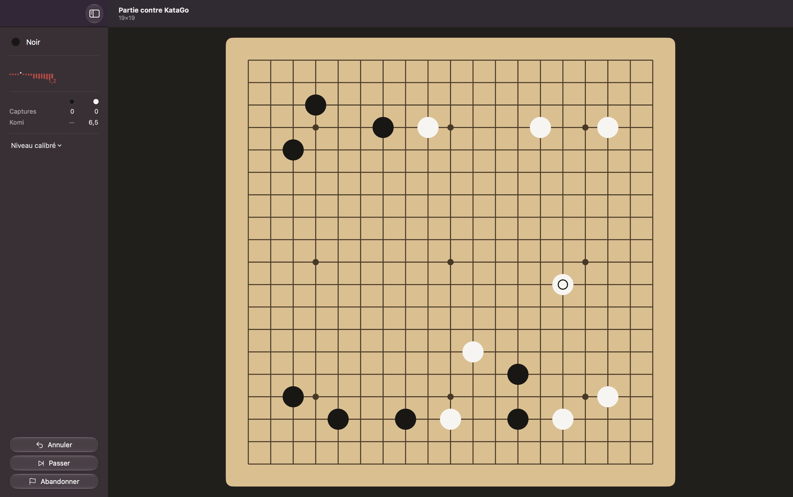

# Beautiful KaTrain

Native macOS interface for [KaTrain](https://github.com/sanderland/katrain), in SwiftUI.



## What it does

- Play KataGo with all sixteen KaTrain AI modes — human-like, period style, calibrated rank,
  influence, territory, tenuki and the rest
- Live score graph, read from the player's side
- End of game: two passes, dead stones proposed from KataGo's ownership then adjustable by
  click, Japanese or Chinese scoring
- Collapsible sidebar, native menus and shortcuts, Liquid Glass

## How it works

```
BeautifulKaTrain.app  ──JSON lines over stdin/stdout──>  bridge.py  ──>  katrain.core  ──>  KataGo
      (SwiftUI)                                           (Python)     (pip, unmodified)
```

The bridge owns the state, the app owns the pixels. No go rule is written in Swift.

## Install

Requires macOS 26+, Xcode, Python 3.11+, and KataGo with a model.

```bash
brew install katago
git clone https://github.com/moifort/beautiful-katrain.git
cd beautiful-katrain
python3 -m venv .venv
.venv/bin/pip install -r bridge/requirements.txt
./app/Scripts/build-app.sh
open app/build/BeautifulKaTrain.app
```

Engine settings are read from `~/.katrain/config.json`, shared with KaTrain.

## Test

```bash
.venv/bin/python -m pytest bridge/tests
swift test --package-path app
```

## Limits

Not distributable: the project path is baked into `Info.plist` at build time and the bridge
runs from the local virtual environment.

No SGF, no analysis mode, no teaching mode.

Territory scoring is the one go rule implemented here — KaTrain derives its final score from
KataGo's ownership and has no notion of a stone marked dead.

## License

MIT, same as KaTrain. KataGo ships separately under its own licence.
